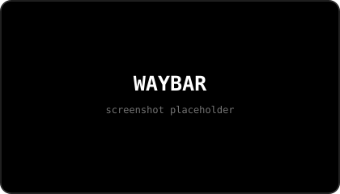
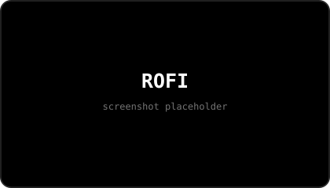
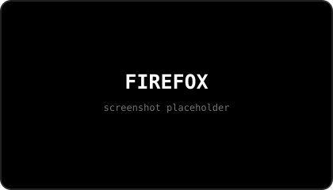
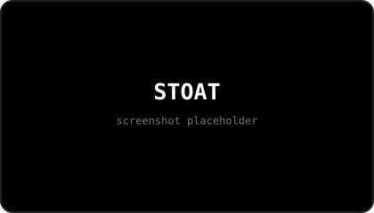
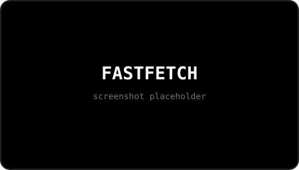

 

  

a collection of my Hyprland rices, setups, experiments, and random desktop ideas.

 

## // ABOUT

This repo is basically every version of my desktop that I decided was worth keeping.

I get bored of my setup way too easily, so instead of deleting old rices, I keep them here. Some are super minimal, some are heavily customized, and some are just setups I made because I thought they looked cool.

They're all part of the same collection, but each setup is meant to stand on its own.

## // COLLECTION

| Setup | Style | Status |
| :--- | :--- | :--- |
| **HUD** | desktop HUD · widgets · overlays | current |
| **Minimalist Black Glass** | minimal · glass · monochrome | placeholder |
| **Green Hacker** | green · terminal · hacker | placeholder |
| **RGB** | RGB · colorful · gaming | placeholder |
| **Neon Blue Hyprland Rice** | neon blue · dark · cyber | placeholder |
| **Space** | space · dark · cosmic | placeholder |
| **Candy** | pastel · colorful · soft | placeholder |
| **Spider-Man** | red · blue · comic | placeholder |
| **Spider-Man: Miles Morales** | red · black · neon | placeholder |
| **Venom** | black · symbiote · dark | placeholder |
| **Carnage** | red · black · chaotic | placeholder |
| **Batman** | black · yellow · dark | placeholder |
| **Deadpool** | red · black · comic | placeholder |
| **Five Nights at Freddy's** | dark · horror · arcade | placeholder |
| **more setups** | whatever I feel like making | soon |

> these are placeholders for now. they'll get their own folders, previews, configs, and setup instructions as I build them.

## // SCREENSHOTS

Each rice gets its own little screenshot set instead of just one preview:

**desktop · Spotify · Waybar · Rofi · Firefox · Stoat · Fastfetch**

<table>
<tr><td align="center" width="50%">

### HUD

   
desktop · Spotify · Waybar  
   
Rofi · Firefox · Stoat  
 Fastfetch

</td><td align="center" width="50%">

### Minimalist Black Glass

   
desktop · Spotify · Waybar  
   
Rofi · Firefox · Stoat  
 Fastfetch

</td></tr>
<tr><td align="center">

### Green Hacker

   desktop · Spotify · Waybar  
   Rofi · Firefox · Stoat  
 Fastfetch

</td><td align="center">

### RGB

   desktop · Spotify · Waybar  
   Rofi · Firefox · Stoat  
 Fastfetch

</td></tr>
<tr><td align="center">

### Neon Blue Hyprland Rice

   desktop · Spotify · Waybar  
   Rofi · Firefox · Stoat  
 Fastfetch

</td><td align="center">

### Space

   desktop · Spotify · Waybar  
   Rofi · Firefox · Stoat  
 Fastfetch

</td></tr>
<tr><td align="center">

### Candy

   desktop · Spotify · Waybar  
   Rofi · Firefox · Stoat  
 Fastfetch

</td><td align="center">

### Spider-Man

   desktop · Spotify · Waybar  
   Rofi · Firefox · Stoat  
 Fastfetch

</td></tr>
<tr><td align="center">

### Spider-Man: Miles Morales

   desktop · Spotify · Waybar  
   Rofi · Firefox · Stoat  
 Fastfetch

</td><td align="center">

### Venom

   desktop · Spotify · Waybar  
   Rofi · Firefox · Stoat  
 Fastfetch

</td></tr>
<tr><td align="center">

### Carnage

   desktop · Spotify · Waybar  
   Rofi · Firefox · Stoat  
 Fastfetch

</td><td align="center">

### Batman

   desktop · Spotify · Waybar  
   Rofi · Firefox · Stoat  
 Fastfetch

</td></tr>
<tr><td align="center">

### Deadpool

   desktop · Spotify · Waybar  
   Rofi · Firefox · Stoat  
 Fastfetch

</td><td align="center">

### Five Nights at Freddy's

   desktop · Spotify · Waybar  
   Rofi · Firefox · Stoat  
 Fastfetch

</td></tr>
</table>

> screenshots are placeholders for now. each setup will eventually have its own real desktop, Spotify, Waybar, Rofi, Firefox, Stoat, and Fastfetch screenshots.

## // CURRENT RICE

My current setup is a mostly black-and-white Hyprland desktop with a minimal UI, subtle glass/blur effects, and a bunch of small custom touches.

It'll probably look completely different eventually lol.

## // WHAT'S IN A SETUP

Each rice can have its own:

- Hyprland config
- Waybar
- wallpapers
- keybinds
- terminal setup
- colors
- window styling
- plugins
- apps
- little custom things

Some setups need more stuff than others, so the dependencies and setup instructions live with the individual rice.

## // INSTALL

Pick a setup and follow the README inside its folder.

Before installing anything, **back up your existing Hyprland configuration.**

These setups can change things like your keybinds, Waybar, wallpapers, applications, and other desktop settings.

## // CUSTOMIZE IT

Don't feel like you have to use these exactly as they are.

Change the colors. Swap the wallpaper. Remove half the stuff. Add your own. Completely break it and rebuild it if you want.

The point is to give you a starting point, not a finished desktop you're supposed to leave untouched.

## // WHY THIS EXISTS

I don't really have one perfect Linux setup.

I make something, use it for a while, get bored, change everything, and eventually end up making another one.

So instead of pretending I'm ever going to settle on one rice, I'm keeping the whole collection here.

---

made for people who like customizing their desktop way too much

 

<i>psst... i use arch btw</i> &nbsp; (👁    _    👁)

