

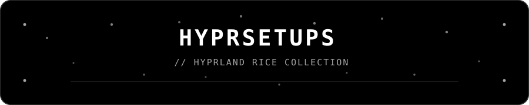

 

  

a collection of my Hyprland rices, setups, experiments, and random desktop ideas.

 

## // ABOUT

This repo is basically every version of my desktop that I decided was worth keeping.

I get bored of my setup way too easily, so instead of deleting old rices, I keep them here. Some are super minimal, some are heavily customized, and some are just setups I made because I thought they looked cool.

They're all part of the same collection, but each setup is meant to stand on its own.

## // COLLECTION

| Setup | Style | Status |
| :--- | :--- | :--- |
| **HUD** | desktop HUD · widgets · overlays | current |
| **Minimalist Black Glass** | minimal · glass · monochrome | placeholder |
| **Green Hacker** | green · terminal · hacker | placeholder |
| **RGB** | RGB · colorful · gaming | placeholder |
| **Neon Blue Hyprland Rice** | neon blue · dark · cyber | placeholder |
| **Space** | space · dark · cosmic | placeholder |
| **Candy** | pastel · colorful · soft | placeholder |
| **Spider-Man** | red · blue · comic | placeholder |
| **Spider-Man: Miles Morales** | red · black · neon | placeholder |
| **Venom** | black · symbiote · dark | placeholder |
| **Carnage** | red · black · chaotic | placeholder |
| **Batman** | black · yellow · dark | placeholder |
| **Deadpool** | red · black · comic | placeholder |
| **Five Nights at Freddy's** | dark · horror · arcade | placeholder |
| **more setups** | whatever I feel like making | soon |

> these are placeholders for now. they'll get their own folders, previews, configs, and setup instructions as I build them.

## // SCREENSHOTS

A visual gallery of the collection. Screenshots will be added as each rice gets built.

<table>
<tr>
<td align="center" width="50%">

**HUD**

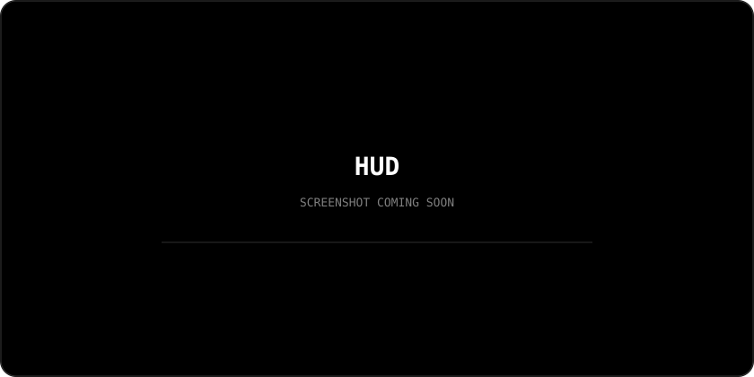

</td>
<td align="center" width="50%">

**Minimalist Black Glass**

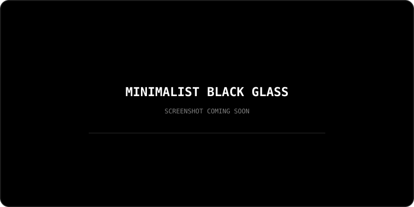

</td>
</tr>
<tr>
<td align="center" width="50%">

**Green Hacker**

</td>
<td align="center" width="50%">

**RGB**

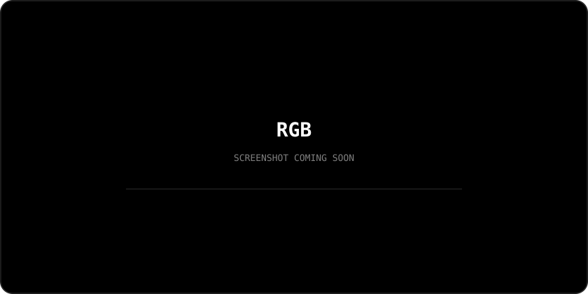

</td>
</tr>
<tr>
<td align="center" width="50%">

**Neon Blue Hyprland Rice**

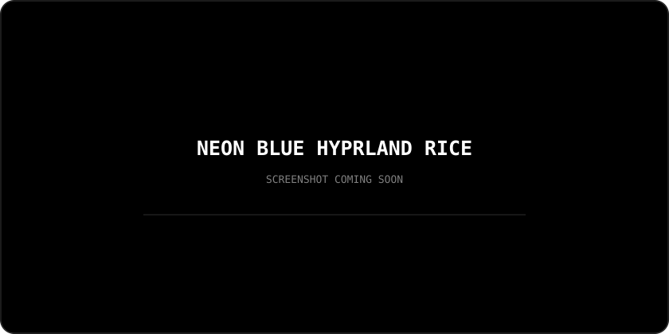

</td>
<td align="center" width="50%">

**Space**

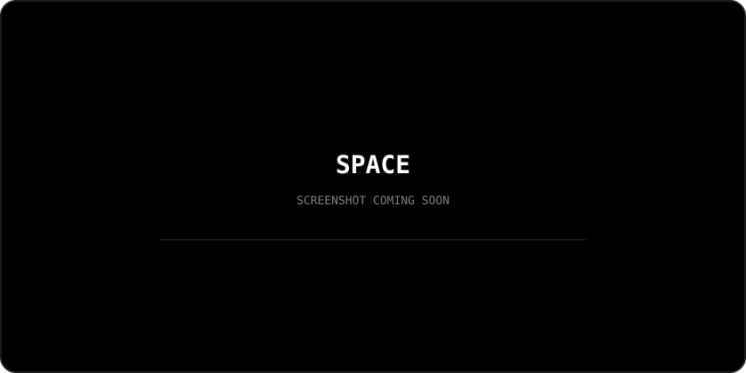

</td>
</tr>
<tr>
<td align="center" width="50%">

**Candy**

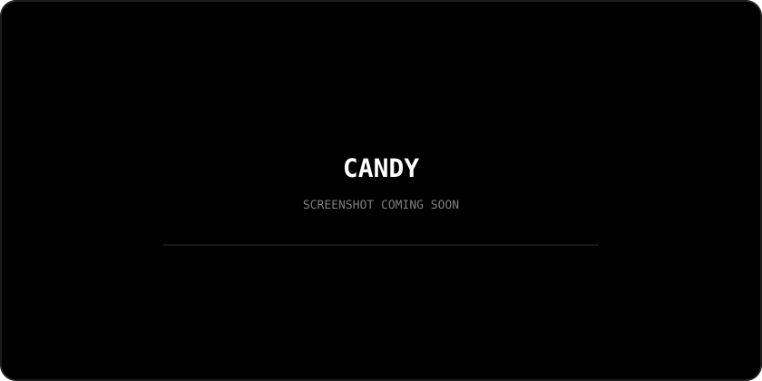

</td>
<td align="center" width="50%">

**Spider-Man**

</td>
</tr>
<tr>
<td align="center" width="50%">

**Spider-Man: Miles Morales**

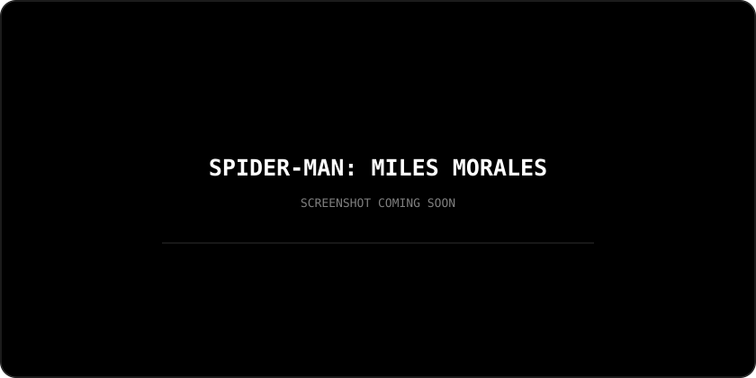

</td>
<td align="center" width="50%">

**Venom**

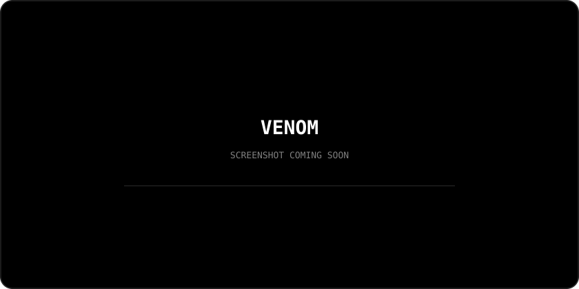

</td>
</tr>
<tr>
<td align="center" width="50%">

**Carnage**

</td>
<td align="center" width="50%">

**Batman**

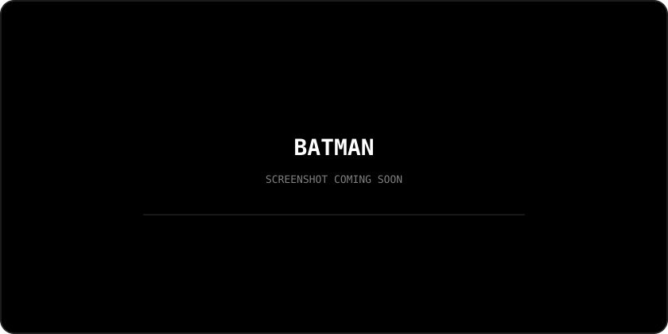

</td>
</tr>
<tr>
<td align="center" width="50%">

**Deadpool**

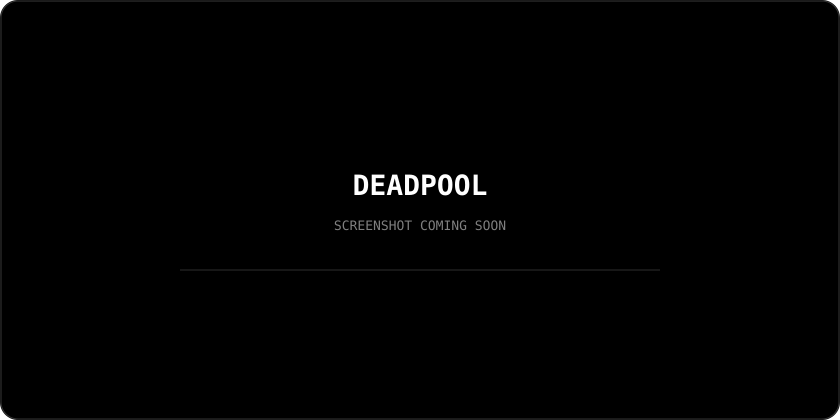

</td>
<td align="center" width="50%">

**Five Nights at Freddy's**

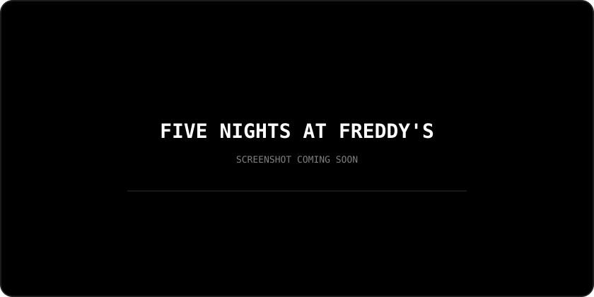

</td>
</tr>
</table>

> screenshots are intentionally placeholders right now. replace each one with the actual rice screenshot when it's ready.

## // CURRENT RICE

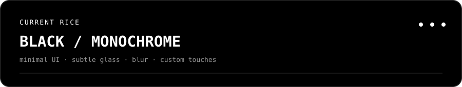

My current setup is a mostly black-and-white Hyprland desktop with a minimal UI, subtle glass/blur effects, and a bunch of small custom touches.

It'll probably look completely different eventually lol.

## // WHAT'S IN A SETUP

Each rice can have its own:

- Hyprland config
- Waybar
- wallpapers
- keybinds
- terminal setup
- colors
- window styling
- plugins
- apps
- little custom things

Some setups need more stuff than others, so the dependencies and setup instructions live with the individual rice.

## // INSTALL

Pick a setup and follow the README inside its folder.

Before installing anything, **back up your existing Hyprland configuration.**

These setups can change things like your keybinds, Waybar, wallpapers, applications, and other desktop settings.

## // CUSTOMIZE IT

Don't feel like you have to use these exactly as they are.

Change the colors. Swap the wallpaper. Remove half the stuff. Add your own. Completely break it and rebuild it if you want.

The point is to give you a starting point, not a finished desktop you're supposed to leave untouched.

## // WHY THIS EXISTS

I don't really have one perfect Linux setup.

I make something, use it for a while, get bored, change everything, and eventually end up making another one.

So instead of pretending I'm ever going to settle on one rice, I'm keeping the whole collection here.

---

made for people who like customizing their desktop way too much

 

<i>psst... i use arch btw</i> &nbsp; (👁    _    👁)

