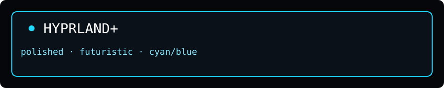
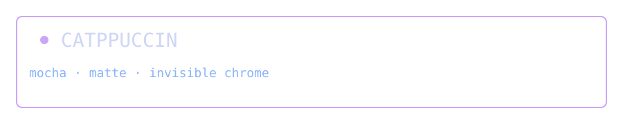
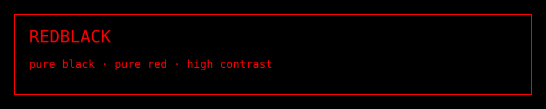
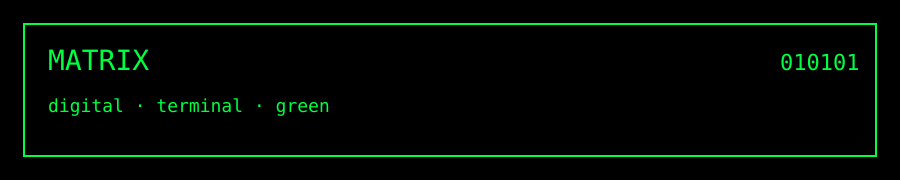
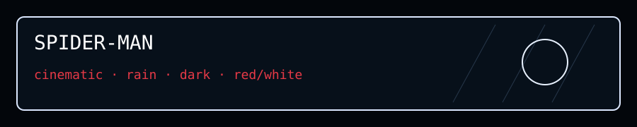
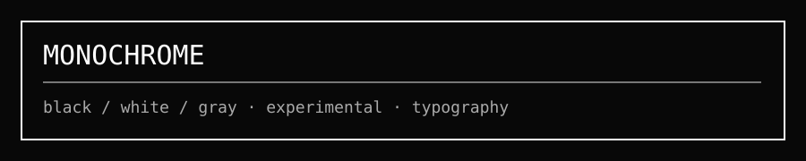

# HYPRSETUPS // RICE COLLECTION

my collection of Hyprland rices.

No giant rice framework. No theme compiler. No database. No 500-file config system.

Just actual dotfiles, wallpapers, scripts, and a few keybinds to switch between setups.

## // THE COLLECTION













| Rice | Style |
| ------ | ----- |
| **Hyprland+** | polished Hyprland · cyan/blue · modern · futuristic |
| **Catppuccin** | Catppuccin Mocha · matte · minimal · invisible chrome |
| **RedBlack** | pure black · pure red · terminal · high contrast |
| **Matrix** | Matrix green · terminal · digital · hacker |
| **Spider-Man** | cinematic · dark · rain · red/white accents |
| **Monochrome** | black/white/gray · experimental · typography-heavy |

Each rice is its own setup. They can have completely different layouts, widgets, bars, launchers, wallpapers, and app configs.

That's kinda the whole point.

## // FILES + FOLDERS

The repo is intentionally simple.

```text
hyprsetups/
├── Hyprland-Plus/
│   ├── hypr/
│   ├── waybar/
│   ├── kitty/
│   ├── rofi/
│   ├── notifications/
│   ├── wallpapers/
│   └── ...
├── Catppuccin/
│   ├── hypr/
│   ├── waybar/
│   ├── kitty/
│   ├── rofi/
│   ├── notifications/
│   ├── wallpapers/
│   └── ...
├── RedBlack/
│   ├── hypr/
│   ├── waybar/
│   ├── kitty/
│   ├── rofi/
│   ├── notifications/
│   ├── wallpapers/
│   └── ...
├── Matrix/
│   └── ...
├── Spider-Man/
│   └── ...
├── Monochrome/
│   └── ...
├── bin/
│   └── dotfiles-setup
├── install.sh
└── README.md
```

The exact contents can be different between rices.

One rice might have a music widget, another might have desktop widgets, another might have almost nothing on the desktop. There isn't a required template that every rice has to follow.

The important part is that the config files are real files you can open and edit.

## // SWITCHING

The collection includes a small rice switcher so you can jump between setups without bringing back a giant theme system.

From the repo:

```sh
git clone https://github.com/yummyfiles/hyprsetups
cd hyprsetups
sh install.sh
```

Or use the switcher:

```sh
dotfiles-setup list
dotfiles-setup use <name>
```

The Rofi selector can also be used to pick a rice directly from the desktop.

## // KEYBINDS

| Shortcut | Action |
| -------- | ------ |
| **SUPER + SHIFT + R** | Open the Rofi rice selector |

More keybinds may be added as the collection grows.

## // WHAT'S INSIDE

Each rice is built around normal config files instead of generated config.

Typical stuff includes:

- Hyprland
- Waybar
- Kitty
- Rofi
- notifications
- wallpapers
- GTK / Qt theming
- app-specific config
- small helper scripts
- rice-specific widgets

A rice can use more or less than another rice. If one setup needs a completely different layout, that's fine.

## // DESIGN PHILOSOPHY

**Keep it simple.**

These are meant to be real, usable desktop setups — not a framework for building frameworks.

- actual config files are the rice
- different rices can be completely different
- no shared theme compiler
- no generated config database
- no unnecessary watchers
- no runtime override system
- no giant compatibility layer
- easy to read
- easy to modify
- easy to delete

Basically: clone it, pick a rice, make it yours.

## // CUSTOMIZE IT

Change whatever you want.

Swap wallpapers, change colors, move widgets around, replace Waybar, rewrite the Rofi layout, add your own scripts — whatever.

These are my setups, but they're just dotfiles at the end of the day.

---

**made by [yummyfiles](https://github.com/yummyfiles)**
